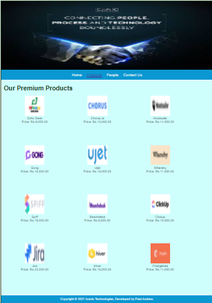
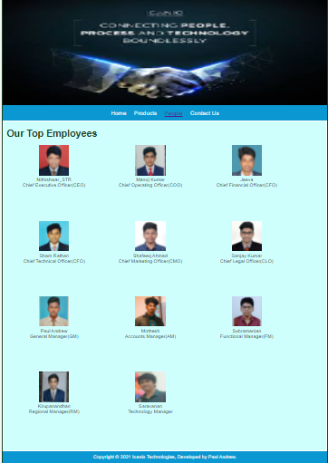
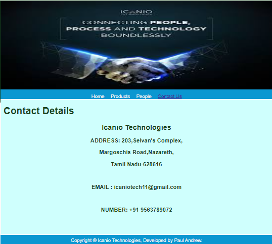
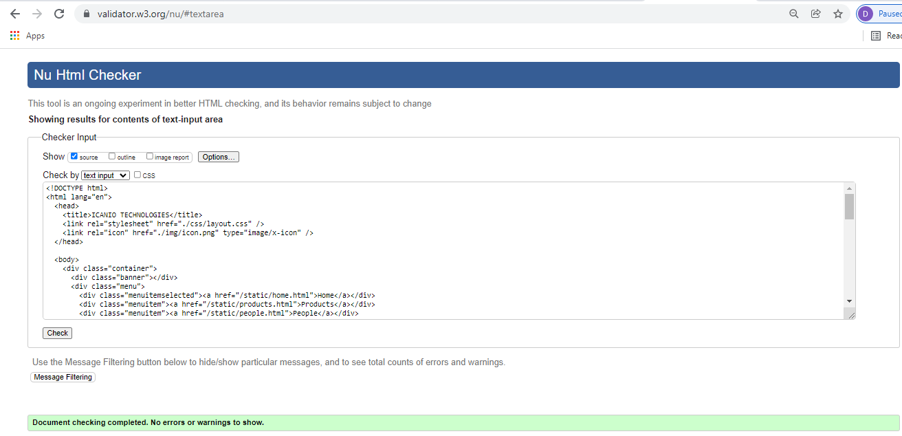

# Web Design for a Software Product Company

## AIM:

To design a static website for a software product company company.

## DESIGN STEPS:

### Step 1:

Requirement collection.

### Step 2:

Creating the layout using HTML and CSS.

### Step 3:

Updating the sample content.

### Step 4:

Choose the appropriate style and color scheme.

### Step 5:

Validate the layout in various browsers.

### Step 6:

Validate the HTML code.

### Step 6:

Publish the website in the given URL.

## PROGRAM :

### Home Page:
```
<!DOCTYPE html>
<html lang="en">
  <head>
    <title>ICANIO TECHNOLOGIES</title>
    <link rel="stylesheet" href="./css/layout.css" />
    <link rel="icon" href="./img/icon.png" type="image/x-icon" />
  </head>

  <body>
    <div class="container">
      <div class="banner"></div>
      <div class="menu">
        <div class="menuitemselected"><a href="/static/home.html">Home</a></div>
        <div class="menuitem"><a href="/static/products.html">Products</a></div>
        <div class="menuitem"><a href="/static/people.html">People</a></div>
        <div class="menuitem"><a href="/static/contactus.html">Contact Us</a></div>
      </div>
      <div class="content">
        <div class="homecontent">
          <h1>About Us</h1>
          
          <div class="contenttext">
            Icanio technologies, credible and ingenious software development company,
            persistently delivering extensive solutions in application development, 
            product development and digital engineering. Our distinguished design-led 
            development process emphasizes that the features and functionality of our apps
            and web systems lead to an innovative product, validated by exhaustive user research.
            <br/>

            <br/>
            At Icanio, we provide development of simple, yet strategic enterprise software applications
            for businesses of any size.
            <br/>

            <br/>
            We are a zealous team of technology maniacs; profoundly passionate about developing optimized,
            robust and astute application and product development services with modernistic technologies. 
            We house all IT specialists – software engineers, designers, mobile developers, QA engineers and 
            DevOps specialists.
            <br/>

            <br/>
            Regardless of the volume we promise to be able to find apt and fitting software development talent
            to serve our clients.
            <br/> 

            <br/>
            <ul>
              <li>Bespoke digital solutions</li>
              <li>Empowering business globally</li>
              <li>Creating awesome customer experiences</li>
            </ul>
          </div>
        </div>
      </div>
      <div class="footer">
        Copyright &#169; 2021 Icanio Technologies, Developed by Paul Andrew.
      </div>
    </div>
  </body>
</html>
```
### Products Page:
```
<!DOCTYPE html>
<html lang="en">
  <head>
    <title>ICANIO TECHNOLOGIES</title>
    <link rel="stylesheet" href="./css/layout.css" />
    <link rel="icon" href="./img/icon.png" type="image/x-icon" />
  </head>

  <body>
    <div class="container">
      <div class="banner"></div>
      <div class="menu">
        <div class="menuitem"><a href="/static/home.html">Home</a></div>
        <div class="menuitemselected">
          <a href="/static/products.html">Products</a>
        </div>
        <div class="menuitem"><a href="/static/people.html">People</a></div>
        <div class="menuitem"><a href="/static/contactus.html">Contact Us</a></div>
      </div>
      <div class="content">
        <div class="productcontent">    
          <h1>Our Premium Products</h1>
          <div class="productitems">
              <div class="productitem"> 
                  <div class="itemimage">
                  
                  </div>
                  <div class="itemname">Zoho Desk</div>
                  <div class="itemprice">Price: Rs.9,000.00 </div>
              </div>
              <div class="productitem"> 
                  <div class="itemimage">
                  
                  </div>
                  <div class="itemname">Chorus.ai</div>
                  <div class="itemprice">Price: Rs.10,000.00 </div>
              </div>
               <div class="productitem"> 
                  <div class="itemimage">
                  
                  </div>
                  <div class="itemname">Hootsuite</div>
                  <div class="itemprice">Price: Rs.14,000.00 </div>
              </div>
                  <div class="productitem"> 
                  <div class="itemimage">
                  
              </div>
                  <div class="itemname">Gong</div>
                  <div class="itemprice">Price: Rs.16,000.00 </div>
             </div>
                 <div class="productitem"> 
                 <div class="itemimage">
                 
             </div>
                 <div class="itemname">Ujet</div>
                <div class="itemprice">Price: Rs.18,000.00 </div>
            </div>
                <div class="productitem"> 
                <div class="itemimage">
                
           </div>
                <div class="itemname">Whereby</div>
               <div class="itemprice">Price: Rs.11,000.00 </div>
          </div>
               <div class="productitem"> 
               <div class="itemimage">
                
          </div>
              <div class="itemname">Spiff</div>
             <div class="itemprice">Price: Rs.19,000.00 </div>
          </div>
             <div class="productitem"> 
             <div class="itemimage">
             
          </div>
              <div class="itemname">Reachdesk</div>
              <div class="itemprice">Price: Rs.8,000.00 </div>
          </div>
             <div class="productitem"> 
             <div class="itemimage">
             
          </div>
              <div class="itemname">Clickup</div>
              <div class="itemprice">Price: Rs.10,000.00 </div>
         </div>
              <div class="productitem"> 
              <div class="itemimage">
              
         </div>
               <div class="itemname">Jira</div>
                <div class="itemprice">Price: Rs.22,000.00 </div>
        </div>
                <div class="productitem"> 
               <div class="itemimage">
               
          </div>
               <div class="itemname">Hiver</div>
               <div class="itemprice">Price: Rs.16,000.00 </div>
          </div>
               <div class="productitem"> 
               <div class="itemimage">
                
         </div>
                <div class="itemname">Chargebee</div>
                <div class="itemprice">Price: Rs.11,000.00 </div>
         </div>
          </div>
          </div>        
      </div>
      <div class="footer">
        Copyright &#169; 2021 Icanio Technologies, Developed by Paul Andrew.
      </div>
    </div>
  </body>
</html>
```
### People Page:
```
<!DOCTYPE html>
<html lang="en">
  <head>
    <title>ICANIO TECHNOLOGIES</title>
    <link rel="stylesheet" href="./css/layout.css" />
    <link rel="icon" href="./img/icon.png" type="image/x-icon" />
  </head>

  <body>
    <div class="container">
      <div class="banner"></div>
      <div class="menu">
        <div class="menuitem"><a href="/static/home.html">Home</a></div>
        <div class="menuitem">
          <a href="/static/products.html">Products</a>
        </div>
        <div class="menuitemselected"><a href="/static/people.html">People</a></div>
        <div class="menuitem"><a href="/static/contactus.html">Contact Us</a></div>
      </div>
      <div class="content">
        <div class="productcontent">    
          <h1>Our Top Employees</h1>
          <div class="productitems">
              <div class="productitem"> 
                  <div class="itemimage">
                  
                  </div>
                  <div class="itemname">Nithishwar_STR</div>
                  <div class="itemprice">Chief Executive Officer(CEO) </div>
              </div>
              <div class="productitem"> 
                  <div class="itemimage">
                  
                  </div>
                  <div class="itemname">Manoj Kumar</div>
                  <div class="itemprice">Chief Operating Officer(COO) </div>
              </div>
               <div class="productitem"> 
                  <div class="itemimage">
                  
                  </div>
                  <div class="itemname">Jeeva</div>
                  <div class="itemprice">Chief Financial Officer(CFO) </div>
              </div>
                  <div class="productitem"> 
                  <div class="itemimage">
                  
              </div>
                  <div class="itemname">Sham Rathan</div>
                  <div class="itemprice">Chief Technical Officer(CFO) </div>
             </div>
                 <div class="productitem"> 
                 <div class="itemimage">
                 
             </div>
                 <div class="itemname">Shafeeq Ahmed</div>
                <div class="itemprice">Chief Marketing Officer(CMO)</div>
            </div>
                <div class="productitem"> 
                <div class="itemimage">
                
           </div>
                <div class="itemname">Sanjay Kumar</div>
               <div class="itemprice">Chief Legal Officer(CLO)</div>
          </div>
               <div class="productitem"> 
               <div class="itemimage">
                
          </div>
              <div class="itemname">Paul Andrew</div>
             <div class="itemprice">General Manager(GM) </div>
          </div>
             <div class="productitem"> 
             <div class="itemimage">
             
          </div>
              <div class="itemname">Mothesh</div>
              <div class="itemprice">Accounts Manager(AM) </div>
          </div>
             <div class="productitem"> 
             <div class="itemimage">
             
          </div>
              <div class="itemname">Subramanian</div>
              <div class="itemprice">Functional Manager(FM)</div>
         </div>
              <div class="productitem"> 
              <div class="itemimage">
              
         </div>
               <div class="itemname">Kirupanandhan</div>
                <div class="itemprice">Regional Manager(RM) </div>
        </div>
                <div class="productitem"> 
               <div class="itemimage">
               
          </div>
               <div class="itemname">Saravanan</div>
               <div class="itemprice">Technology Manager </div>
        </div>
          </div>
          </div>        
      </div>
      <div class="footer">
        Copyright &#169; 2021 Icanio Technologies, Developed by Paul Andrew.
      </div>
    </div>
  </body>
</html>
```
### Contact Us Page:
```
<!DOCTYPE html>
<html lang="en">
  <head>
    <title></title>
    <link rel="stylesheet" href="./css/layout.css" />
    <link rel="icon" href="./img/icon.png" type="image/x-icon" />
  </head>
  <body>
    <div class="container">
      <div class="banner"></div>
      <div class="menu">
        <div class="menuitem"><a href="/static/home.html">Home</a></div>
        <div class="menuitem"><a href="/static/products.html">Products</a></div>
        <div class="menuitem"><a href='/static/people.html'>People</a></div>
        <div class="menuitemselected">
            <a href='/static/contactus.html'>Contact Us</a>
      </div>
      <div class="content">
        <div class="productcontent">    
          <h1>Contact Details</h1>
          <div class="productitems">
            <h2>Icanio Technologies</h2>
            <h3>ADDRESS: 203,Selvan's Complex,</h3>
            <h3>Margoschis Road,Nazareth,</h3>
            <h3>Tamil Nadu-628616</h3>
          </br>
            <h3>EMAIL : icaniotech11@gmail.com</h3>
          </br>
            <h3>NUMBER: +91 9563789072</h3>
          </div>
          </div>        
      </div>
      <div class="footer">
        Copyright &#169; Icanio Technologies, Developed by Paul Andrew.
      </div>
    </div>
  </body>
</html>
```

## OUTPUT:

### Home Page:


### Products Page:



### People Page:



### Contact Us Page:



### HTML Validator:


## Result:

Thus a website is designed for the software product company and the HTML,CSS code are validated.
